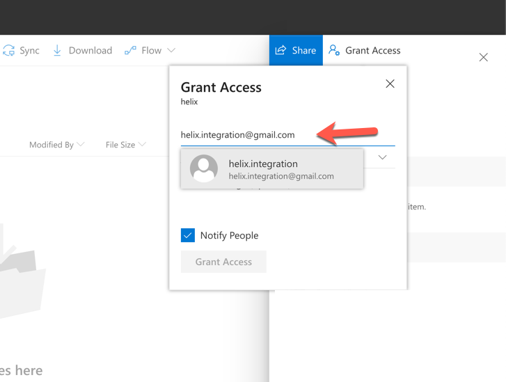

# Helix Word to Markdown

> A service that converts word documents to markdown.

## Status
[](https://codecov.io/gh/adobe/helix-word2md)
[](https://circleci.com/gh/adobe/helix-word2md)
[](https://github.com/adobe/helix-word2md/blob/master/LICENSE.txt)
[](https://github.com/adobe/helix-word2md/issues)
[](https://lgtm.com/projects/g/adobe/helix-word2md)
[](https://github.com/semantic-release/semantic-release) [](https://greenkeeper.io/)

## Installation

## Usage

```bash
curl https://adobeioruntime.net/api/v1/web/helix/helix-services/word2md@v1?shareLink=...&path=...
```

## Testing

You can browse the OneDrive integration using the _browser.js_:

1. start with: `npm run start`.
2. open web browser at `http://localhost:3000/`.
3. sign in with microsoft.
3. copy-paste share-link of a shared folder (see below) and click the `list` button.

## Authentication

The action authenticates against OneDrive using an oauth2 refresh token. In case you need to
create a new one, use the _browser.js_ to generate a `tokens.json`.

## Development

### Deploying Helix Word to Markdown

Deploying a helix service requires the `wsk` command line client, authenticated to a namespace of your choice. For Project Helix, we use the `helix` namespace.

All commits to master that pass the testing will be deployed automatically. All commits to branches that will pass the testing will get commited as `/helix-services/gdocs2md@ci<num>` and tagged with the CI build number.

## Appendix

### Setting up a shared folder in OneDrive

1. Create a new folder in OneDrive. eg `helix`.
2. Click on the (i) button and then _Manage Access_.

3. Add the email address of the user you want to share. for the integration with helix-pages use: `helix.integration@gmail.com`.

4. Click on _Copy Link_ and then _Copy_ in order to copy the link to your clipboard.

5. Create a word document in your folder. eg: `test.docx`.
6. open a browser at `https://adobeioruntime.net/api/v1/web/helix/helix-services/word2md@v1?shareLink=<your-share-link>&path=/test.docx`.


